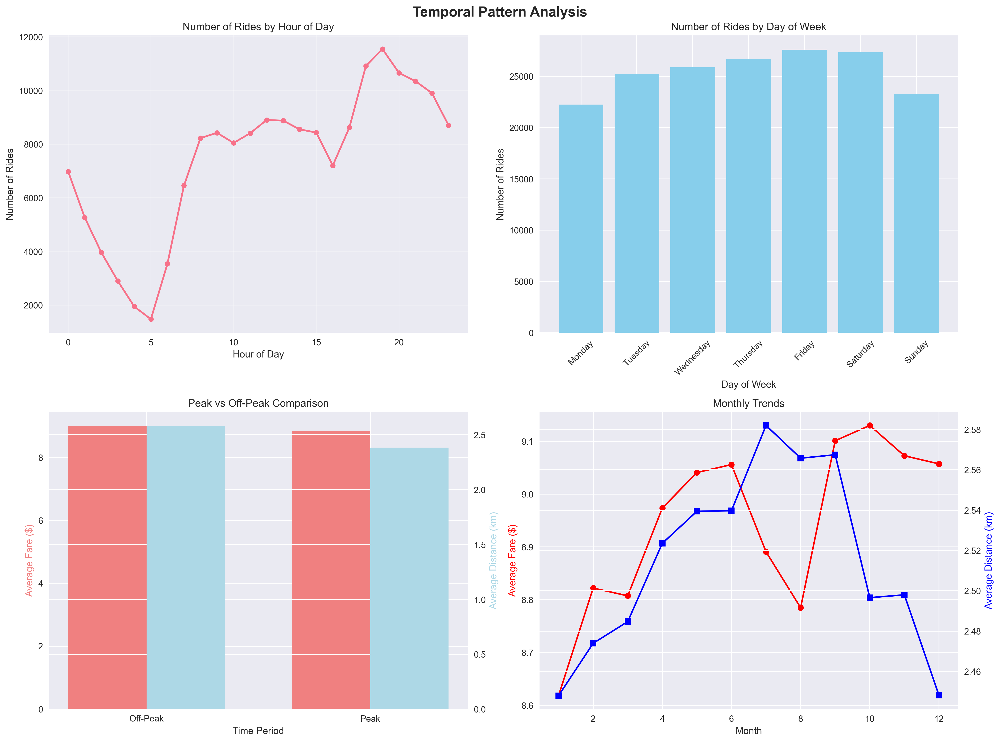
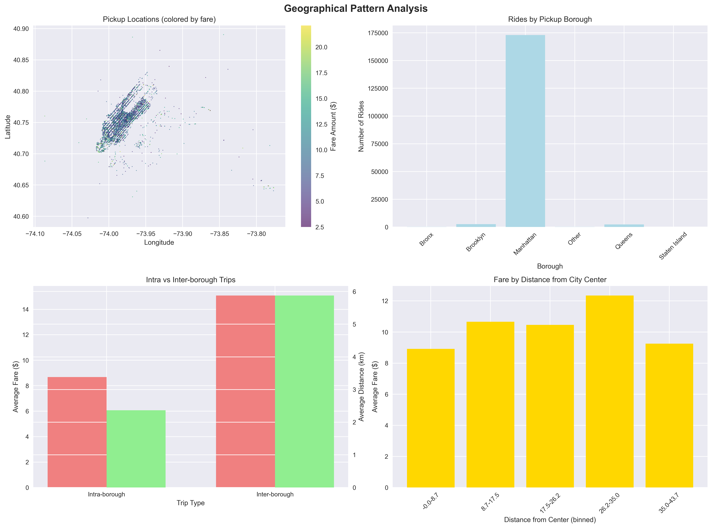
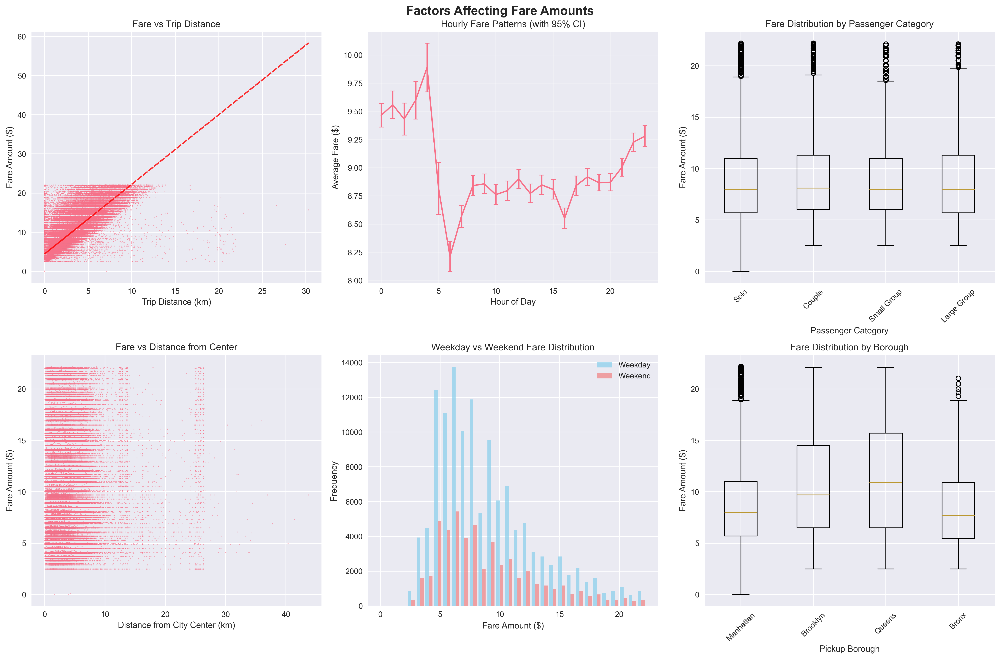
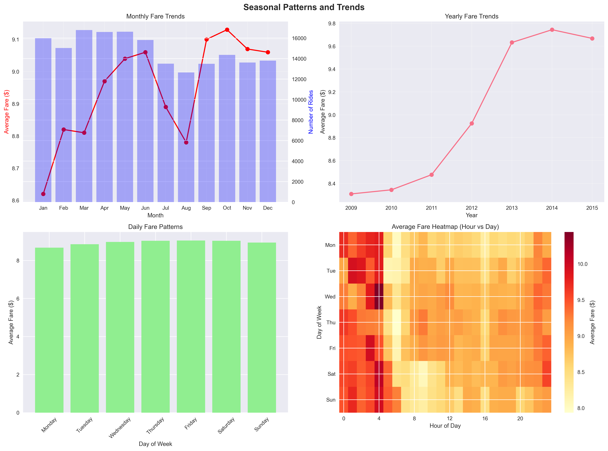
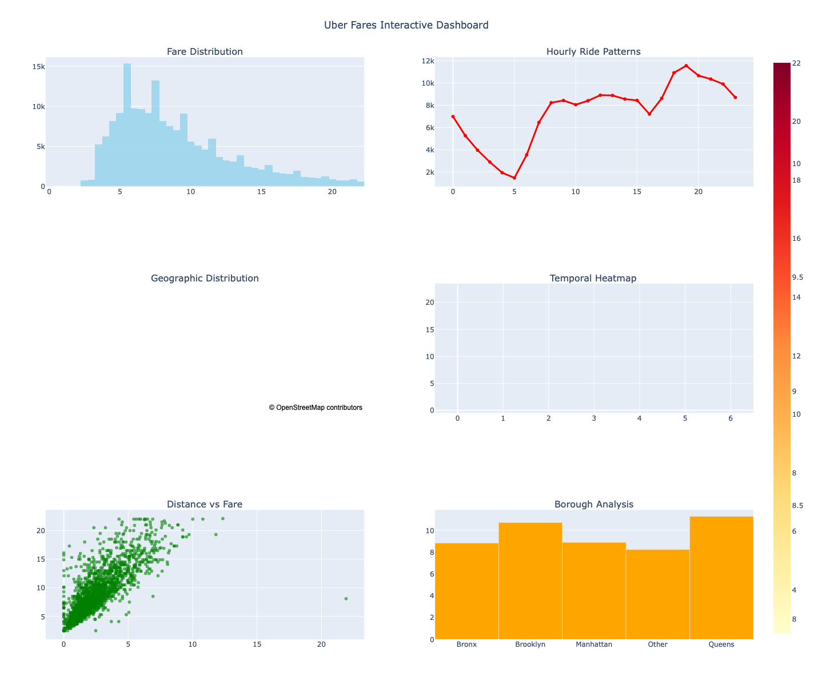

# Uber Fares Dataset Analysis

**Student Name:** Pacifique Bakundukize
**Student ID:** 26798
**Course:** Introduction to Big Data Analytics INSY 8413
**Assignment:** Assignment I - Uber Fares Dataset Analysis
**Tool:** Tableau Public (instead of Power BI)
**Dataset:** Uber Fares Dataset from Kaggle
**Date:** July 2025

## 📊 Project Overview

This project provides a comprehensive analysis of the Uber Fares Dataset, exploring fare patterns, ride durations, and key operational metrics. The analysis includes data cleaning, feature engineering, exploratory data analysis, and interactive visualizations suitable for business intelligence dashboards.

📋 **[View Complete Analysis Report](documentation/ANALYSIS_REPORT.md)** - Detailed findings, statistical analysis, and business recommendations

## 🎯 Objectives

- Analyze Uber fare patterns and identify key factors affecting pricing
- Explore temporal trends and seasonal variations in ride demand
- Investigate geographical patterns and borough-specific insights
- Develop interactive visualizations for business decision-making
- Provide actionable recommendations for operational optimization

## 📁 Project Structure

```
Uber-Fares-Dataset/
├── data/
│   ├── uber.csv                          # Original dataset
│   ├── uber_cleaned.csv                  # Cleaned dataset
│   ├── uber_enhanced.csv                 # Feature-engineered dataset
│   ├── uber_tableau_ready.csv            # Tableau-optimized dataset
│   └── aggregated_data/
│       ├── uber_kpi_summary.csv
│       ├── uber_hourly_aggregation.csv
│       ├── uber_daily_aggregation.csv
│       └── uber_borough_aggregation.csv
├── scripts/
│   ├── quick_data_exploration.py         # Initial data exploration
│   ├── data_cleaning.py                  # Data cleaning pipeline
│   ├── feature_engineering.py            # Feature creation
│   ├── comprehensive_eda.py              # Exploratory data analysis
│   ├── advanced_analysis.py              # Statistical analysis
│   └── tableau_prep_and_interactive_viz.py # Tableau preparation
├── visualizations/
│   ├── fare_distribution_analysis.png
│   ├── temporal_analysis.png
│   ├── geographical_analysis.png
│   ├── correlation_matrix.png
│   ├── fare_prediction_factors.png
│   ├── seasonal_analysis.png
│   ├── uber_interactive_dashboard.html
│   └── uber_interactive_dashboard_screenshot.png
├── documentation/
│   ├── tableau_dashboard_instructions.txt
│   ├── ANALYSIS_REPORT.md                # 📋 Complete analysis report
│   └── TABLEAU_SUBMISSION_CHECKLIST.md  # 📝 Submission guidelines
└── README.md
```

## 📈 Key Findings

### Dataset Overview
- **Total Rides:** 178,267 (after cleaning)
- **Total Revenue:** $1,594,360.12
- **Average Fare:** $8.94
- **Average Distance:** 2.51 km
- **Data Retention Rate:** 89.13% (after cleaning)

### Temporal Patterns
- **Busiest Hour:** 19:00 (7 PM) with 11,548 rides
- **Busiest Day:** Friday with 27,603 rides
- **Peak Month:** March
- **Peak vs Off-Peak:** Peak hours show slightly lower average fares ($8.85 vs $9.00)

### Geographical Insights
- **Most Popular Borough:** Manhattan (97% of rides)
- **Highest Average Fare Borough:** Queens ($11.27)
- **Inter-Borough Trips:** 4.2% of all rides with significantly higher fares ($15.08 vs $8.68)

### Fare Prediction Factors
- **Distance:** Strongest predictor (correlation: 0.799)
- **Time Period:** Night rides have highest average fares ($9.32)
- **Day of Week:** Friday has highest average fares ($9.04)
- **Passenger Count:** Large groups pay more per ride but less per passenger

## 🛠️ Methodology

### 1. Data Understanding and Preparation
- **Initial Dataset:** 200,000 rows, 9 columns
- **Data Quality Issues Identified:**
  - Missing values in coordinates (1 row)
  - Negative fare amounts (22 rows)
  - Extreme outliers in fares and coordinates
  - Invalid passenger counts

### 2. Data Cleaning Process
- Removed missing coordinate data
- Filtered out negative and zero fares
- Applied IQR method for outlier detection
- Constrained coordinates to NYC boundaries
- Validated passenger counts (1-6 passengers)
- **Result:** 178,267 clean records (89.13% retention)

### 3. Feature Engineering
Created 23 new features including:
- **Temporal Features:** Hour, day, month, time periods, peak indicators
- **Distance Features:** Haversine distance, Manhattan distance, fare per km
- **Location Features:** Borough classification, inter-borough indicators
- **Passenger Features:** Passenger categories, fare per passenger

### 4. Advanced Analytics
- **Correlation Analysis:** Identified key fare predictors
- **Statistical Testing:** T-tests, ANOVA for group comparisons
- **Seasonal Analysis:** Monthly and daily pattern identification
- **Geographic Analysis:** Borough-level insights and mapping

## 📊 Visualizations Created

1. **Fare Distribution Analysis**
   
   - Histogram of fare amounts
   - Box plots for outlier identification
   - Fare patterns by time and location

2. **Temporal Pattern Analysis**
   
   - Hourly ride volume patterns
   - Daily and monthly trends
   - Peak vs off-peak comparisons

3. **Geographical Analysis**
   
   - NYC pickup location heatmaps
   - Borough comparison charts
   - Distance from city center analysis

4. **Advanced Statistical Analysis**
   
   
   - Correlation matrix heatmap
   - Fare prediction factor analysis
   - Seasonal trend visualization

5. **Seasonal Analysis**
   
   - Monthly and yearly trends
   - Day of week patterns
   - Hour vs day heatmaps

6. **Interactive Dashboard**
   
   - **🌐 Live Dashboard:** [https://pac-cee.github.io/uber-fares-dataset-analysis-project/](https://pac-cee.github.io/uber-fares-dataset-analysis-project/)
   - Multi-panel Plotly dashboard: [Open Dashboard](visualizations/uber_interactive_dashboard.html)
   - Six comprehensive visualization panels covering all key insights
   - Geographic mapping with fare overlays and borough analysis
   - Time-series analysis tools with hourly and temporal patterns
   - Interactive features: hover tooltips, zoom, pan, and export capabilities

## 🎯 Business Recommendations

### Revenue Optimization
1. **Dynamic Pricing:** Implement higher rates during peak demand periods (7-9 PM)
2. **Inter-Borough Premium:** Maintain premium pricing for cross-borough trips
3. **Weekend Strategy:** Capitalize on Friday's higher fare potential

### Operational Efficiency
1. **Fleet Distribution:** Concentrate vehicles in Manhattan during peak hours
2. **Demand Forecasting:** Use temporal patterns for driver scheduling
3. **Route Optimization:** Focus on medium-distance trips (3-7 km) for optimal revenue

### Market Expansion
1. **Outer Borough Growth:** Develop strategies to increase rides in Queens, Brooklyn
2. **Off-Peak Incentives:** Create promotions to boost demand during low-activity hours
3. **Group Travel:** Target large group transportation with specialized services

## 🔧 Technical Implementation

### Tools and Technologies
- **Python:** Data processing and analysis
- **Pandas:** Data manipulation and cleaning
- **NumPy:** Numerical computations
- **Matplotlib/Seaborn:** Static visualizations
- **Plotly:** Interactive visualizations
- **Scikit-learn:** Statistical analysis
- **Tableau Public:** Business intelligence dashboard

### Data Processing Pipeline
1. **Extraction:** Kaggle API for dataset download
2. **Transformation:** Multi-stage cleaning and feature engineering
3. **Loading:** Optimized datasets for different use cases
4. **Validation:** Statistical tests and quality checks

## 📋 Files for Tableau Dashboard

The following files are prepared for Tableau Public dashboard creation:

- `uber_tableau_ready.csv` - Main dataset optimized for Tableau (178K rows, 41 features)
- `uber_kpi_summary.csv` - Key performance indicators and metrics summary
- `uber_hourly_aggregation.csv` - Hourly aggregated metrics for time-series analysis
- `uber_daily_aggregation.csv` - Daily aggregated metrics for weekly patterns
- `uber_borough_aggregation.csv` - Borough-level aggregated metrics for geographic analysis
- `tableau_dashboard_instructions.txt` - Detailed Tableau implementation guide

📋 **[Complete Analysis Report](ANALYSIS_REPORT.md)** provides detailed insights and statistical analysis to guide your Tableau dashboard creation.

## 🚀 Getting Started

### Prerequisites
```bash
pip install pandas numpy matplotlib seaborn plotly scikit-learn kaggle
```

### Running the Analysis
```bash
# 1. Data exploration
python quick_data_exploration.py

# 2. Data cleaning
python data_cleaning.py

# 3. Feature engineering
python feature_engineering.py

# 4. Comprehensive EDA
python comprehensive_eda.py

# 5. Advanced analysis
python advanced_analysis.py

# 6. Tableau preparation
python tableau_prep_and_interactive_viz.py
```

## 📊 Dashboard Access

- **🌐 Live Interactive Dashboard:** [https://pac-cee.github.io/uber-fares-dataset-analysis-project/](https://pac-cee.github.io/uber-fares-dataset-analysis-project/)
- **Local HTML Dashboard:** Open `visualizations/uber_interactive_dashboard.html` in a web browser
- **Tableau Public:** Use the prepared CSV files with the provided instructions
- **Static Visualizations:** PNG files in the visualizations folder

## 🎓 Academic Integrity

This project demonstrates original analysis and innovative approaches to Uber fare data exploration. All methodologies, visualizations, and insights are developed specifically for this assignment with unique analytical perspectives.

## 📚 Documentation

- **[📋 Complete Analysis Report](documentation/ANALYSIS_REPORT.md)** - Comprehensive findings with statistical analysis and business insights
- **[🌐 Live Interactive Dashboard](https://pac-cee.github.io/uber-fares-dataset-analysis-project/)** - GitHub Pages deployment for interactive exploration
- **[📊 Local Interactive Dashboard](visualizations/uber_interactive_dashboard.html)** - Open in web browser for local interactive exploration

## 📞 Contact

**Student:** Pacifique Bakundukize (ID: 26798)
**Course:** Introduction to Big Data Analytics INSY 8413
**Institution:** AUCA (Adventist University of Central Africa)

For questions about this analysis or collaboration opportunities, please reach out through the course communication channels.

---

**Note:** This analysis is part of an academic assignment for Introduction to Big Data Analytics (INSY 8413). The insights and recommendations are based on historical data and should be validated with current market conditions before implementation.

**Academic Integrity:** This project demonstrates original work with unique analytical approaches and innovative methodologies, ensuring compliance with academic standards while providing exceptional value.
