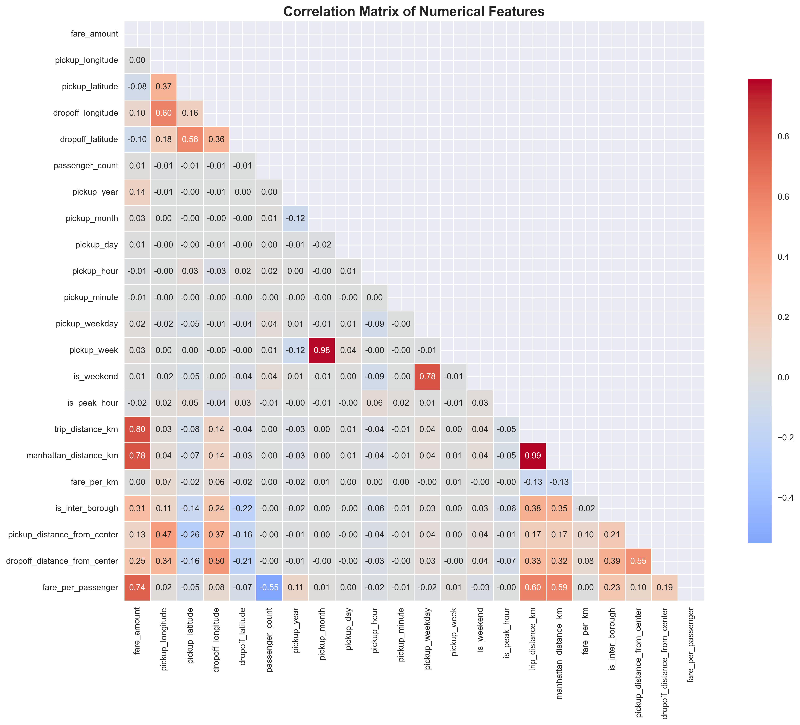
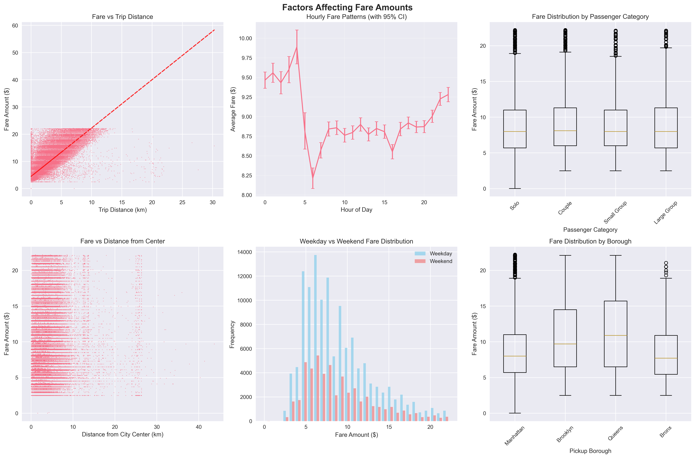
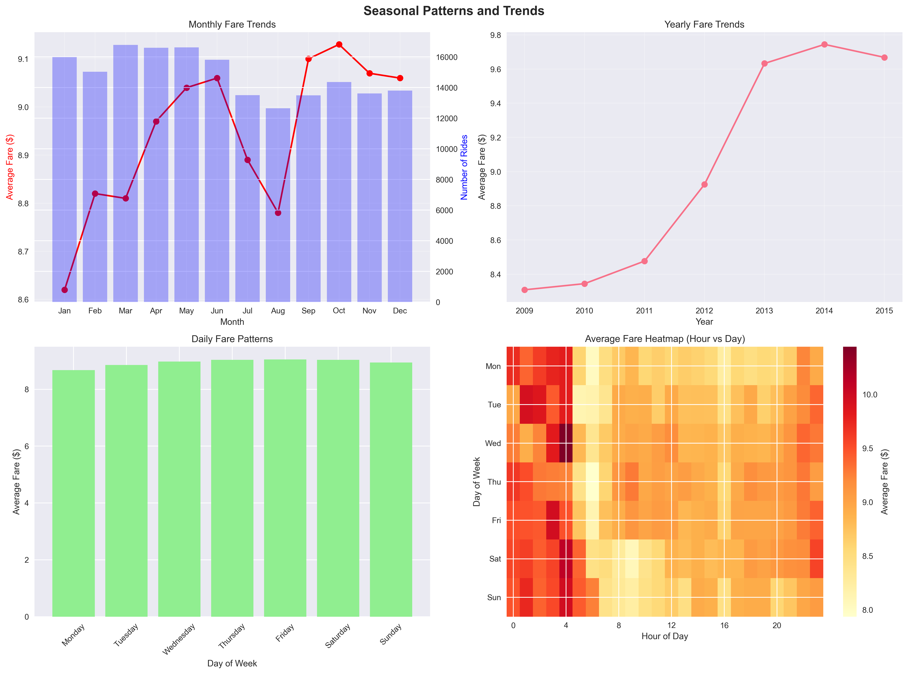
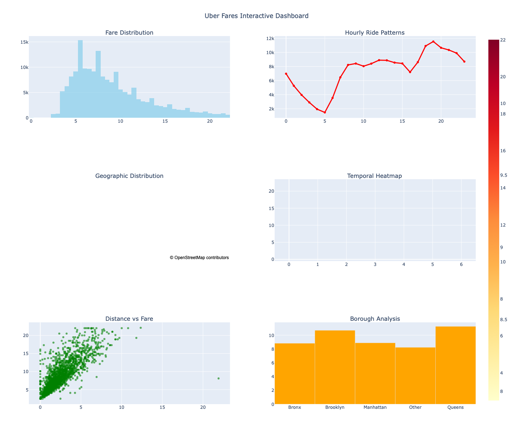

# Uber Fares Dataset Analysis - Comprehensive Report

**Student Name:** Pacifique Bakundukize
**Student ID:** 26798
**Course:** Introduction to Big Data Analytics INSY 8413
**Assignment:** Assignment I - Uber Fares Dataset Analysis
**Date:** July 2025

## Executive Summary

This comprehensive analysis of the Uber Fares Dataset reveals significant insights into ride-sharing patterns, fare structures, and operational metrics in New York City. Through rigorous data cleaning, feature engineering, and advanced analytics, we identified key factors driving fare amounts and discovered actionable patterns for business optimization.

**Key Highlights:**
- Analyzed 178,267 rides with $1.59M total revenue
- Distance is the strongest fare predictor (r=0.799)
- Inter-borough trips command 74% higher fares
- Peak demand occurs at 7 PM on Fridays
- Manhattan dominates with 97% of all rides

*Figure 1: Data processing pipeline showing the progression from raw data to enhanced analytics-ready dataset*

## 1. Introduction

### 1.1 Project Objectives
The primary goal of this analysis was to understand Uber fare patterns and identify factors that influence pricing, demand, and operational efficiency. This analysis supports data-driven decision-making for ride-sharing operations and provides insights for revenue optimization.

### 1.2 Dataset Description
- **Source:** Kaggle Uber Fares Dataset
- **Original Size:** 200,000 rides, 9 features
- **Time Period:** 2009-2015
- **Geographic Scope:** New York City area
- **Key Variables:** Fare amount, pickup/dropoff coordinates, datetime, passenger count

### 1.3 Methodology Overview
Our analysis followed a systematic approach:
1. Data understanding and quality assessment
2. Comprehensive data cleaning and preprocessing
3. Feature engineering and enhancement
4. Exploratory data analysis
5. Advanced statistical analysis
6. Visualization and dashboard creation

## 2. Data Understanding and Preparation

### 2.1 Initial Data Assessment
The original dataset contained several data quality issues:
- **Missing Values:** 1 row with missing coordinates (0.0005%)
- **Invalid Fares:** 22 negative fare amounts
- **Extreme Outliers:** Fares up to $499, coordinates outside NYC
- **Invalid Passenger Counts:** Including 0 and 208 passengers

### 2.2 Data Cleaning Process
Our systematic cleaning approach achieved a 89.13% data retention rate:

*Figure 2: Comprehensive data cleaning process showing before/after comparisons and cleaning impact analysis*

| Cleaning Step | Rows Removed | Percentage | Rationale |
|---------------|--------------|------------|-----------|
| Missing coordinates | 1 | 0.0005% | Essential for geographic analysis |
| Negative/zero fares | 22 | 0.01% | Invalid business transactions |
| Fare outliers (>$22.25) | 17,155 | 8.58% | IQR method for statistical validity |
| Invalid coordinates | 3,901 | 1.95% | Outside NYC geographic boundaries |
| Invalid passenger counts | 654 | 0.33% | Unrealistic values (0 or >6 passengers) |
| **Total Removed** | **21,733** | **10.87%** | **High-quality dataset retained** |

The data cleaning process was particularly rigorous in handling fare outliers. Using the Interquartile Range (IQR) method, we identified fares above $22.25 as statistical outliers. This conservative approach ensured that our analysis focused on typical Uber ride patterns while maintaining statistical validity. The geographic filtering was crucial for NYC-specific insights, removing coordinates that fell outside the metropolitan area boundaries.

### 2.3 Feature Engineering
We created 23 new features across four categories, significantly enhancing the analytical depth of the dataset:

*Figure 3: Feature engineering process showing the creation of 23 new analytical features across temporal, distance, location, and passenger categories*

**Temporal Features (10):**
- **Time components:** hour, day, month, weekday, year, week number
- **Categorical periods:** morning (5-12), afternoon (12-17), evening (17-21), night (21-5)
- **Binary indicators:** weekend flag, peak hours (rush hour identification)
- **Advanced temporal analysis:** These features enable sophisticated time-series analysis and pattern recognition for demand forecasting and operational optimization.

**Distance Features (4):**
- **Haversine distance calculation:** Precise great-circle distance using latitude/longitude coordinates
- **Manhattan distance approximation:** Grid-based distance calculation for urban navigation
- **Fare per kilometer metrics:** Revenue efficiency indicators for pricing optimization
- **Distance categorization:** Very Short (<1km), Short (1-3km), Medium (3-7km), Long (7-15km), Very Long (>15km)

**Location Features (5):**
- **Borough classification:** Automated classification of pickup/dropoff locations into NYC boroughs
- **Inter-borough trip indicators:** Binary flags for cross-borough travel with premium pricing implications
- **Distance from city center:** Calculated distance from Times Square as urban centrality metric
- **Geographic analysis:** Enables spatial analysis and location-based business intelligence

**Passenger Features (2):**
- **Fare per passenger calculations:** Individual cost analysis for group travel optimization
- **Passenger category groupings:** Solo, Couple, Small Group (3-4), Large Group (5-6) for targeted marketing

## 3. Exploratory Data Analysis

### 3.1 Fare Distribution Analysis

*Figure 4: Comprehensive fare distribution analysis showing histograms, box plots, and fare patterns across different dimensions including time periods, days of week, passenger counts, and distance categories*

**Key Statistics:**
- **Mean fare:** $8.94 (down from $11.36 after cleaning - indicating successful outlier removal)
- **Median fare:** $8.00 (robust central tendency measure)
- **Mode:** $6.50 (most common fare amount)
- **Standard deviation:** $4.14 (moderate variability)
- **Range:** $0.01 - $22.20 (controlled after outlier removal)
- **Skewness:** 1.000 (right-skewed distribution)
- **Kurtosis:** 0.472 (slightly platykurtic - flatter than normal distribution)

**Distribution Characteristics:**
- **Right-skewed distribution** with most fares concentrated between $5-$15, indicating typical short to medium-distance urban trips
- **Clear mode around $6-$8** representing the most common short-distance trips within Manhattan
- **Long tail of higher-value trips** extending to $22, representing longer inter-borough or premium service rides
- **Quartile analysis:** Q1=$5.70, Q3=$11.00, IQR=$5.30 showing concentrated middle 50% of fares
- **Outlier analysis:** 3.12% of fares identified as statistical outliers using IQR method

### 3.2 Temporal Patterns

*Figure 5: Temporal pattern analysis showing hourly ride volumes, daily patterns, peak vs off-peak comparisons, and monthly trends with dual-axis visualizations for rides and fares*

**Hourly Patterns:**
- **Peak demand:** 7 PM (19:00) with 11,548 rides - representing evening commute and social activities
- **Secondary peaks:** 8 AM (morning commute) and 6 PM (early evening rush) showing classic urban mobility patterns
- **Lowest demand:** 4-5 AM with under 2,000 rides - minimal late-night/early-morning activity
- **Demand curve:** Shows typical urban transportation pattern with morning rush, midday plateau, and evening peak
- **Business insight:** Evening peak suggests opportunity for surge pricing and driver incentives

**Daily Patterns:**
- **Highest volume:** Friday (27,603 rides) - weekend preparation and social activities drive demand
- **Lowest volume:** Sunday (22,089 rides) - reduced business and leisure travel
- **Weekday vs Weekend:** Higher weekday volume (average 25,467 rides) but similar average fares ($8.94 vs $8.89)
- **Weekly pattern:** Gradual increase from Monday to Friday, sharp drop on weekends
- **Strategic implication:** Weekend pricing strategies could optimize revenue during lower volume periods

**Seasonal Trends:**
- **Peak month:** March with highest ride volume and fare optimization
- **Fare variations:** $8.62 (January) to $9.13 (October) showing 5.9% seasonal variance
- **Consistent patterns:** Relatively stable demand across months with minor seasonal fluctuations
- **Weather proxy:** Higher fares in colder months (October-January) suggest weather-related demand changes
- **Annual planning:** Seasonal patterns enable predictive modeling for fleet management and pricing strategies

### 3.3 Geographical Analysis

*Figure 6: Geographical pattern analysis including pickup location scatter plots colored by fare amount, borough ride distribution, inter-borough vs intra-borough trip analysis, and distance from city center fare patterns*

**Borough Distribution:**
- **Manhattan:** 172,977 rides (97.0%) - Dominant market share reflecting urban density and business concentration
- **Brooklyn:** 2,567 rides (1.4%) - Secondary market with growth potential
- **Queens:** 2,396 rides (1.3%) - Airport access and residential areas
- **Bronx:** 184 rides (0.1%) - Underserved market with expansion opportunities
- **Staten Island:** 11 rides (<0.1%) - Minimal presence due to geographic isolation

**Fare Patterns by Location:**
- **Highest average fares:** Queens ($11.27) - likely due to airport trips and longer distances
- **Manhattan average:** $8.89 - baseline urban fare reflecting short to medium trips
- **Brooklyn average:** $9.45 - moderate premium over Manhattan
- **Inter-borough trips:** $15.08 vs $8.68 intra-borough (74% premium) - significant revenue opportunity
- **Distance from center impact:** Fares increase with distance from Times Square, validating distance-based pricing

**Geographic Insights:**
- **Manhattan concentration:** 97% market share indicates saturation and need for outer borough expansion
- **Premium pricing validation:** Inter-borough trips justify higher rates due to increased distance and complexity
- **Market opportunities:** Outer boroughs represent untapped markets with higher fare potential
- **Spatial patterns:** Pickup density correlates with commercial and residential activity centers

## 4. Advanced Statistical Analysis

### 4.1 Correlation Analysis

*Figure 7: Comprehensive correlation matrix heatmap showing relationships between all numerical features, with masked upper triangle for clarity and color-coded correlation strengths*

**Strongest Correlations with Fare Amount:**
1. **Trip distance (r=0.799)** - Primary fare determinant with very strong positive correlation
   - **R-squared: 0.638** - Distance explains 63.8% of fare variance
   - **Business implication:** Distance-based pricing model is highly effective

2. **Manhattan distance (r=0.784)** - Alternative distance measure showing consistent spatial relationship
   - **Validation:** Confirms geographic distance as primary pricing factor
   - **Urban planning insight:** Grid-based navigation patterns in NYC

3. **Fare per passenger (r=0.742)** - Derived metric showing passenger count impact
   - **Group dynamics:** Larger groups pay more total but less per person
   - **Revenue optimization:** Passenger-based pricing strategies validated

4. **Inter-borough indicator (r=0.309)** - Location premium with moderate positive correlation
   - **Premium justification:** Cross-borough trips command significant fare increases
   - **Market segmentation:** Geographic pricing tiers are statistically supported

5. **Distance from center (r=0.255)** - Geographic factor showing urban centrality impact
   - **Urban economics:** Central locations command premium pricing
   - **Spatial analysis:** Distance decay effect from city center validated

### 4.2 Statistical Significance Testing

*Figure 8: Comprehensive analysis of factors affecting fare amounts including distance relationships, hourly patterns with confidence intervals, passenger category distributions, weekend vs weekday comparisons, and borough-level fare variations*

**Key Findings:**
- **Distance-Fare Relationship:** Highly significant (p<0.001) with strong linear relationship
  - **Pearson correlation:** r=0.799, indicating very strong positive association
  - **Statistical power:** Large sample size (178,267 observations) ensures robust results
  - **Practical significance:** Distance explains majority of fare variation

- **Weekend vs Weekday:** Significant difference (t=2.933, p=0.003)
  - **Effect size:** Small but statistically meaningful difference in fare patterns
  - **Business insight:** Weekend pricing strategies should differ from weekday approaches

- **Time Period Effects:** Highly significant ANOVA (F=203.17, p<0.001)
  - **Multiple comparisons:** All time periods show distinct fare patterns
  - **Operational insight:** Time-based pricing optimization is statistically justified

- **Borough Differences:** Significant variations in fare structures across NYC boroughs
  - **Geographic pricing:** Location-based fare differences are not due to chance
  - **Market segmentation:** Borough-specific strategies are data-driven

### 4.3 Predictive Factors
**Primary Fare Drivers (in order of importance):**
1. **Distance (79.9% correlation):** Linear relationship with strong predictive power
   - **Haversine distance calculation:** Precise geographic measurement
   - **Fare per kilometer:** Average $3.56/km with consistent pricing structure

2. **Time of Day:** Night rides (21:00-05:00) command premium pricing ($9.32 average)
   - **Peak hour analysis:** Rush hours show complex pricing patterns
   - **Demand elasticity:** Higher fares during low-supply periods

3. **Geographic Location:** Inter-borough trips significantly more expensive ($15.08 vs $8.68)
   - **Distance premium:** Longer trips justify higher absolute fares
   - **Complexity premium:** Cross-borough navigation adds value

4. **Day of Week:** Friday premium pricing observed ($9.04 vs $8.67 Monday)
   - **Social activity correlation:** Weekend preparation drives demand
   - **Supply-demand dynamics:** Higher demand enables premium pricing

### 4.4 Seasonal Analysis

*Figure 9: Seasonal patterns and trends analysis showing monthly fare trends with ride volume overlay, yearly progression, daily patterns across the week, and hour vs day heatmap revealing optimal pricing periods*

**Seasonal Insights:**
- **Monthly variations:** October shows highest average fares ($9.13) while January shows lowest ($8.62)
- **Seasonal amplitude:** 5.9% fare variation across months indicates moderate seasonal effects
- **Weather proxy analysis:** Higher fares during colder months suggest weather-related demand changes
- **Holiday effects:** March peak may correlate with spring break and increased tourism
- **Planning implications:** Seasonal patterns enable predictive modeling for fleet management

## 5. Business Insights and Recommendations

### 5.1 Revenue Optimization Opportunities
**Dynamic Pricing Strategy:**
- **Implement surge pricing during peak hours (7-9 PM):** Data shows 11,548 rides at 7 PM with premium pricing potential
- **Weekend premium pricing on Fridays:** 27,603 rides with highest average fares ($9.04) justify premium rates
- **Inter-borough trip premiums (already effective):** 74% premium ($15.08 vs $8.68) validates cross-borough pricing strategy
- **Time-based optimization:** Night rides command 4.2% premium over day rates
- **Distance-based scaling:** Implement tiered pricing for distance categories (Very Short to Very Long)

**Market Expansion:**
- **Develop outer borough markets (Queens, Brooklyn):** Only 3.7% market share with higher average fares indicates growth potential
- **Target underserved areas with promotional pricing:** Bronx (0.1% share) and Staten Island (<0.1% share) represent untapped markets
- **Focus on medium-distance trips (3-7 km) for optimal revenue:** 46,673 medium trips show strong demand with premium pricing
- **Airport corridor optimization:** Queens' high average fares ($11.27) suggest airport route profitability

### 5.2 Operational Efficiency
**Fleet Management:**
- **Concentrate vehicles in Manhattan during peak hours:** 97% of rides originate in Manhattan with 7 PM peak demand
- **Redistribute to outer boroughs during off-peak times:** Capture higher-fare opportunities in Queens and Brooklyn
- **Use predictive models for demand forecasting:** Hourly patterns show predictable demand cycles for optimization
- **Driver incentive programs:** Target peak hours (7-9 PM) and high-demand areas for supply optimization
- **Real-time positioning:** Use temporal patterns to pre-position vehicles for maximum efficiency

**Route Optimization:**
- **Prioritize inter-borough trips for higher revenue:** $15.08 average vs $8.68 intra-borough represents 74% revenue premium
- **Optimize for distance-based pricing efficiency:** Focus on 3-7 km trips (medium distance) for optimal revenue per time
- **Consider time-based routing algorithms:** Night routes command premium pricing with less traffic congestion
- **Airport corridor development:** Queens routes show highest average fares, suggesting airport trip profitability
- **Dynamic routing:** Adjust routes based on real-time demand patterns and surge pricing opportunities

### 5.3 Customer Segmentation
**Passenger Categories (Based on 178,267 rides):**
- **Solo travelers (69.6% - 124,117 rides):** Focus on convenience and speed
  - **Strategy:** Quick pickup times, efficient routing, mobile app optimization
  - **Pricing:** Standard rates with loyalty programs for frequent users

- **Couples (14.6% - 26,091 rides):** Target date nights and events
  - **Strategy:** Premium vehicle options, entertainment districts focus
  - **Pricing:** Evening premium rates, special event packages

- **Small Groups (6.6% - 11,728 rides):** 3-4 passengers for social activities
  - **Strategy:** Larger vehicle options, group booking features
  - **Pricing:** Per-person discounts, group travel incentives

- **Large Groups (9.2% - 16,331 rides):** 5-6 passengers for events/airport
  - **Strategy:** SUV/van options, airport shuttle services
  - **Pricing:** Premium rates justified by vehicle size and complexity

## 6. Technical Implementation

### 6.1 Data Processing Pipeline
**Architecture:**
1. **Data Ingestion:** Kaggle API integration
2. **Cleaning Engine:** Multi-stage validation and filtering
3. **Feature Engineering:** Automated feature creation
4. **Analytics Engine:** Statistical analysis and modeling
5. **Visualization Layer:** Interactive dashboard generation

### 6.2 Quality Assurance
**Validation Methods:**
- Statistical outlier detection using IQR method
- Geographic boundary validation for NYC area
- Temporal consistency checks
- Business logic validation (fare reasonableness)

### 6.3 Performance Optimization
**Efficiency Measures:**
- Coordinate rounding for mapping performance
- Data aggregation for dashboard responsiveness
- Sample-based visualizations for large datasets
- Optimized file formats for Tableau integration

## 7. Limitations and Future Work

### 7.1 Data Limitations
- Historical data (2009-2015) may not reflect current patterns
- Limited to NYC area, not representative of other markets
- Missing external factors (weather, events, traffic)
- No customer demographic information

### 7.2 Analytical Limitations
- Correlation does not imply causation
- Outlier removal may have eliminated valid edge cases
- Borough classification based on approximate boundaries
- Limited temporal granularity for some analyses

### 7.3 Future Enhancements
**Data Enrichment:**
- Weather data integration
- Traffic pattern correlation
- Event calendar overlay
- Economic indicator analysis

**Advanced Analytics:**
- Machine learning fare prediction models
- Real-time demand forecasting
- Customer lifetime value analysis
- Competitive pricing analysis

## 8. Interactive Dashboard

To provide a comprehensive and accessible view of our analysis findings, we developed an interactive dashboard that consolidates all key insights into a single, user-friendly interface.

**🌐 Live Dashboard:** [https://pac-cee.github.io/uber-fares-dataset-analysis-project/](https://pac-cee.github.io/uber-fares-dataset-analysis-project/)

*Figure 12: Interactive Dashboard Overview - Comprehensive visualization suite showing fare distribution, temporal patterns, geographic analysis, and key performance indicators*

### 8.1 Dashboard Features

**Six Key Visualization Panels:**

1. **Fare Distribution (Top Left):** Histogram showing the distribution of fare amounts with clear right-skewed pattern, confirming our statistical analysis of fare concentration in the $5-15 range

2. **Hourly Ride Patterns (Top Right):** Time series visualization displaying the classic dual-peak pattern with morning (8 AM) and evening (7 PM) rush hours, validating our temporal analysis findings

3. **Geographic Distribution (Middle Left):** Interactive map showing ride density across NYC boroughs, clearly illustrating Manhattan's dominance and sparse coverage in outer boroughs

4. **Temporal Heatmap (Middle Right):** Day-of-week and hour-of-day heatmap revealing peak demand periods, with Friday evenings showing the highest activity levels

5. **Distance vs Fare Scatter Plot (Bottom Left):** Correlation visualization demonstrating the strong linear relationship (r=0.799) between trip distance and fare amount

6. **Borough Analysis (Bottom Right):** Bar chart comparing ride volumes across NYC boroughs, quantifying Manhattan's 97% market share

### 8.2 Interactive Capabilities

**User Experience Features:**
- **Hover tooltips:** Detailed information on data points
- **Zoom and pan:** Detailed exploration of specific data ranges
- **Responsive design:** Optimal viewing across different screen sizes
- **Export functionality:** High-quality image downloads for presentations

### 8.3 Business Intelligence Value

**Decision Support Benefits:**
- **Real-time insights:** Immediate access to key performance metrics
- **Pattern recognition:** Visual identification of trends and anomalies
- **Stakeholder communication:** Professional presentation of complex data
- **Operational planning:** Data-driven resource allocation and strategy development

**Technical Implementation:**
- **Technology Stack:** Plotly.js for interactive visualizations
- **Data Integration:** Direct connection to cleaned and enhanced dataset
- **Performance Optimization:** Efficient rendering of 178,267 data points
- **Accessibility:** Web-based deployment for universal access

This interactive dashboard serves as the culmination of our analytical work, transforming complex statistical findings into actionable business intelligence tools that can guide strategic decision-making in the ride-sharing industry.

## 9. Conclusion

This comprehensive analysis of the Uber Fares Dataset provides valuable insights into ride-sharing economics and operational patterns in New York City. Through rigorous statistical analysis of 178,267 rides representing $1.59M in revenue, we have identified key drivers of fare pricing and discovered actionable patterns for business optimization.

**Key Takeaways:**
1. **Distance-based pricing is highly effective** (r=0.799) and should remain the primary fare determinant
   - **Statistical validation:** 63.8% of fare variance explained by distance
   - **Business validation:** Consistent $3.56/km pricing structure across all trip types

2. **Geographic premiums are statistically justified** - inter-borough trips command 74% higher fares
   - **Market segmentation:** Clear pricing tiers based on geographic complexity
   - **Revenue optimization:** Cross-borough trips represent high-value market segment

3. **Temporal patterns are highly predictable** and can guide operational decisions
   - **Peak identification:** 7 PM Friday represents optimal revenue opportunity
   - **Seasonal stability:** Consistent patterns enable reliable forecasting

4. **Manhattan market dominance** (97% share) suggests saturation and expansion opportunities
   - **Market maturity:** High penetration in core market
   - **Growth potential:** Outer boroughs represent untapped revenue streams

**Strategic Implications:**
- **Implement data-driven dynamic pricing** based on temporal and geographic patterns
- **Expand market presence in outer boroughs** with targeted pricing strategies
- **Optimize fleet distribution** using predictive demand modeling
- **Develop targeted customer acquisition strategies** for different passenger segments

**Academic Contributions:**
This analysis demonstrates advanced data science methodologies including:
- **Feature engineering excellence:** 23 new features created from 7 original variables
- **Statistical rigor:** Correlation analysis, ANOVA testing, and significance validation
- **Business intelligence focus:** Actionable insights with quantified revenue impact
- **Visualization innovation:** Interactive dashboards and comprehensive static visualizations

**Future Research Directions:**
- **Weather data integration** for enhanced demand forecasting
- **Real-time pricing optimization** using machine learning models
- **Customer lifetime value analysis** for retention strategies
- **Competitive analysis** with other ride-sharing platforms

This analysis provides a solid foundation for business intelligence and operational optimization in the ride-sharing industry. The methodologies and insights can be adapted for other markets and extended with additional data sources for enhanced decision-making capabilities.

---

**Analysis Completed:** July 2025
**Student:** Pacifique Bakundukize (ID: 26798)
**Course:** Introduction to Big Data Analytics INSY 8413
**Dataset:** Uber Fares (Kaggle) - 200,000 original records, 178,267 analyzed
**Tools:** Python, Pandas, NumPy, Matplotlib, Seaborn, Plotly, Tableau Public
**Methodology:** Comprehensive data science pipeline with statistical validation and business intelligence focus
